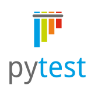
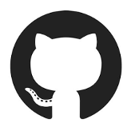

# Deploying tools for a successful testing environment for an open-source software: Shimming Toolbox

## About Me

I am a PhD student at Polytechnique in Montreal where I am in Biomedical Engineering. My area of research revolves around improving the homogeneity of the main magnetic field (B0 shimming) in Magnetic Resonance Imaging (MRI). To do so, I have written an open-source toolbox ([Shimming Toolbox](https://shimming-toolbox.org/en/latest/)) that allows to perform shimming calculations.

## Project Definition

### Background

[Shimming Toolbox](https://shimming-toolbox.org/en/latest/) is version controlled in this [GitHub repository](https://github.com/shimming-toolbox/shimming-toolbox). The toolbox can be installed on a computer and can perform DICOM conversion to NIfTI, create masks, compute B0 field maps, compute B1 shimming coefficients and compute B0 shimming coefficients. All these features can be performed for already acquired data or directly while acquiring at the MRI scanner. The following figure visually shows the main features of Shimming Toolbox.


To make sure the toolbox performs as expected, it is important to write tests for the various code functions. These tests are called unit tests and make sure that the expected output of small pieces of code give specific, pre-determined outputs. Another form of test, called integration tests, test broader functionalities and make sure small functions can be linked together to perform an expected functionality. Both of these make sure a code base has the expected functionalities, but also make sure that these functionalities and output remain through time if there are code changes, new functionalities, library updates and more. While setting up those tests require a good time investment, it is worthwhile in the long run as it will catch software bugs and therefore improve user experience and also reduce time spent fixing these bugs.

Although it is possible to manually launch the tests on a local machine at every change of the code, it is much more valuable to set up a continuous integration (CI) pipeline that will automatically launch these tests on every push to the GitHub repository. This removes a burden on the developer, it makes sure that these tests are run systematically and provide a tracking history of what works and what does not.

Shimming Toolbox is separated in two repositories. The main one includes the main functionalities and allow a user to run them from the command line and includes many CI features such as tests and automation with GitHub Actions. A separate repository adds a graphical user interface (GUI) as a plugin to the popular NIfTI viewer [FSLeyes](https://fsl.fmrib.ox.ac.uk/fsl/fslwiki/FSLeyes) and is shown in the following image. The Shimming Toolbox GUI [repository](https://github.com/shimming-toolbox/fsleyes-plugin-shimming-toolbox) does not contain many CI features and will be the one I will be improving in this BrainHack project. A challenge of this repository is that most of the code is for the GUI which makes it a lot more difficult to test, especially on platforms that do not have displays.


### Objectives

The main objective of this project is to improve the testing pipeline and capabilities of Shimming Toolbox’s GUI repository. The main objectives are described below.

* Implement tests for various pieces of code
* Set up continuous integration to automatically perform the tests
* Set up containers to test the GUI locally on different platforms

This will allow to prevent future software bugs, reduce maintenance time and improve the user experience.

### Tools

This project relies on the following tools:

* {width=50 height=50}[Pytest](https://docs.pytest.org/en/7.3.x/contents.html) to write and setup unit and integration tests
* [Github Actions](https://docs.github.com/en/actions) to automatically:
    * Launch the tests
    * Launch [pre-commit](https://pre-commit.com) to verify that commits meet certain standards (these will be described below)
* [Docker](https://www.docker.com) to create containers to locally launch the tests for linux
* GitHub

<p float="left">
    
    
    
    
</p>

### Data

This project is unusual in the sense that the Shimming Toolbox's GUI code is the main part of the data used for this project. The different tests, CI pipelines and Docker containers will have as data the GUI code itself. For some more involved tests where shimming data is required, Shimming Toolbox already has a [testing data repository](https://github.com/shimming-toolbox/data-testing) where lightweight "somewhat" BIDS compliant data as well as DICOM files that can be used.

### Deliverables

The different deliverables of this project include:
 * Unit and integration tests that have been implemented in the Shimming Toolbox GUI [repository](https://github.com/shimming-toolbox/fsleyes-plugin-shimming-toolbox). These tests have been copied in this repository under */tests*
 * GitHub Actions configuration files that can run the previous tests and prevent unwanted commits (e.g., large files, merge conflicts, etc). The configuration files for the GUI repository is included in this repository under */github_actions*
 * A Dockerfile to set up images with Shimming Toolbox installed able to run the tests. Similarly, the file that resides in the Shimming Toolbox's GUI repository is included under the folder */docker*

[ADD LINK TO THE DIFFERENT FOLDERS]

### Results

#### Deliverable 1: Tests

During the BrainHack project, I have set up 4 different tests. The first one is a unit test that makes sure a particular function works properly. The three other tests make sure that the GUI works as expected. These GUI tests are more challenging to implement since they cannot easily be tested without launching the whole application, in my case, FSLeyes. Therefore the first step was to figure out how to first launch FSLeyes so that the plugin which I am testing can also be launched. Since FSLeyes is also open source, I investigated how their testing pipeline worked so I could see how they perform their tests. I ended up including and modifying a file that could launch FSLeyes and set up same code to properly launch the Shimming Toolbox plugin. This is the first GUI test where it makes sure that loading the plugin does not crash.

Now that the plugin can be launched, I wanted to test that it was properly initialized. The first thing a user might want to do when opening up Shimming Toolbox is to change tabs. So I wrote a test that makes sure that the tabs that should be there are indeed initialized.

The third and last test that I wrote goes into much more detail to make sure that the plugin can call Shimming Toolbox's command line functions. I chose the DICOM to NIfTI functionality of Shimming Toolbox as this is the first step in most processing pipelines. To test this functionality, I needed so DICOM data. Luckily, a lightweight repository containing DICOMs was previously set up. I created a *conftest.py* file that will be performed first whenever Pytest will launch the tests. This allow to automatically download this repository before running tests and ensuring that the user has the appropriate data to run them. After that, I could set up the test to change to the DICOM to NIfTI tab, look for specific buttons in the user interface, fill them with appropriate values and press the run button to start the command. The test then waits for images to show in the FSLeyes overlay signifying that the command was executed successfully.

[INSERT LINK TO FILES]

Although more unit and GUI tests are needed to test more of the specific functionalities, this is a good start that will make sure in the future new functionalities are well tested. Even though this is only four tests, I ran a coverage report that looks at how many lines of code are covered by the tests out of the total number of lines in the project. 81% of the lines in the project were ran during the tests and a report of the individual files is shown in the following image. Overall, this does not mean that 81% of the code is fully tested but it is a good start.

[INSERT COVERAGE REPORT IMAGE]

Note that to launch the tests on Mac, I needed to use pythonw:

```
pythonw -m pytest
```

#### Deliverable 2: Continuous Integration Pipeline

##### GitHub Actions for launching Tests

Now that the tests are written, it is important to set up a pipeline to automatically run them on the code on a server. This can be done using Github Actions. A configuration file was set up to automatically perform the following actions on two Ubuntu machines. It first installs the plugin  y downloading an installing FSLeyes, Shimming Toolbox, the plugin and the required dependencies of each package. The tests can then be launched. However, since a GUI is being tested and that the server used to run these test do not have a screen, we need one last tool to simulate a virtual screen. This tool is X virtual frame buffer (Xvfb) and allows a headless (no screen) Linux computer to run GUI applications even if it does not have a display. Using the following, the tests can be launched and will makes sure that on every push to the repository that the tests succeed.

```
xvfb-run -a -s "-screen 0 1920x1200x24" py.test . -v
```

##### Github Actions for launching pre-commit checks

Precommit is a tool that makes sure that commits meet certain criteria. It can be set up to check for different things. Moreover, it can be set up locally by using a precommit file and as a Github action.

Among other things, precommit will:
* Check if the commit added a large file
* Check python syntax
* Check if there are merge conflicts
* Check GitHub actions config files

To locally check these specific things, I have included a *.precommit.yml* file in the plugin repository that will reject a commit if a requirement is not met. I have also included a GitHub Actions *config file* that will look at the commit and throw an error if there is a requirement that is not met on a push to the repository.

[LINKS]

#### Deliverable 3: Dockerfile

I have also set up a Dockerfile that contains instructions about what to do when setting up the Docker container. These step include copying the local repository in the container and installing necessary dependencies such as "curl", "vim" and "Xvfb" that will be used by the installer of the testing suite. The script that downloads and installs Shimming Toolbox, FSLeyes and the GUI is the automatically ran and conda is then initialized so that a user only has to run the tests. After cloning the repo and installing Docker, the only steps remaining are to navigate through the command line and perform the commands to build and launch the docker container:

```
cd fsleyes-plugin-shimming-toolbox
docker rm --force fpst
docker build --tag fpst:latest .
docker run --name fpst -dit fpst:latest
docker exex -it fpst bash
```

In the container, it is then possible to launch the tests using the same command that was needed in GitHub Actions. This is required since a container does not have a screen:

```
xvfb-run -a -s "-screen 0 1920x1200x24" py.test . -v
```

The tests will launch and should display a similar image as the following one explaining that the tests have passed. Note that only a Linux container will work with this command.

[INSERT DOCKER_TEST IMAGE]

## Conclusion and acknowledgement

I have learned a lot throughout the project. I developed my skills using many different software including Pytest, GitHub Actions, pre-commit, Docker and many more. I was able to successfully implement a testing environment for the GUI of Shimming Toolbox. In the future, these tests will makes sure that less bugs slip through the cracks. This will save developers time and will provide a better user experience. However, there are some limitation to this project. Tests are only performed on Linux since I was not able to find a comparable solution to Xvfb which does not seem to work for MacOS. Therefore MacOS is not automatically tested and should be in the future. Moreover, more tests are required to properly make sure the plugin works. These will need to be implemented in the future.

Overall, BrainHack school was an amazing experience where I learned a lot and recommend to others seeking to learn about open-science.

## References

D'Astous A, Cereza G, Papp D, Gilbert KM, Stockmann JP, Alonso-Ortiz E, Cohen-Adad J. Shimming toolbox: An open-source software toolbox for B0 and B1 shimming in MRI. Magn Reson Med. 2022; 1-17. doi:10.1002/mrm.29528

McCarthy P. FSLeyes. 2019.

dcm2niix

dcm2bids

TODO:
- Check spelling of pytest
- Check spelling of precommit
- Add links
- Add img
- REFS
